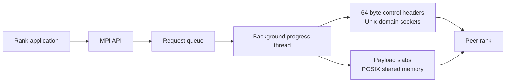
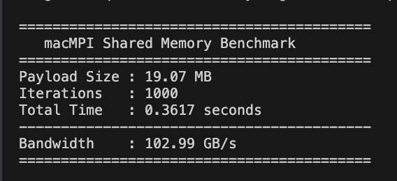
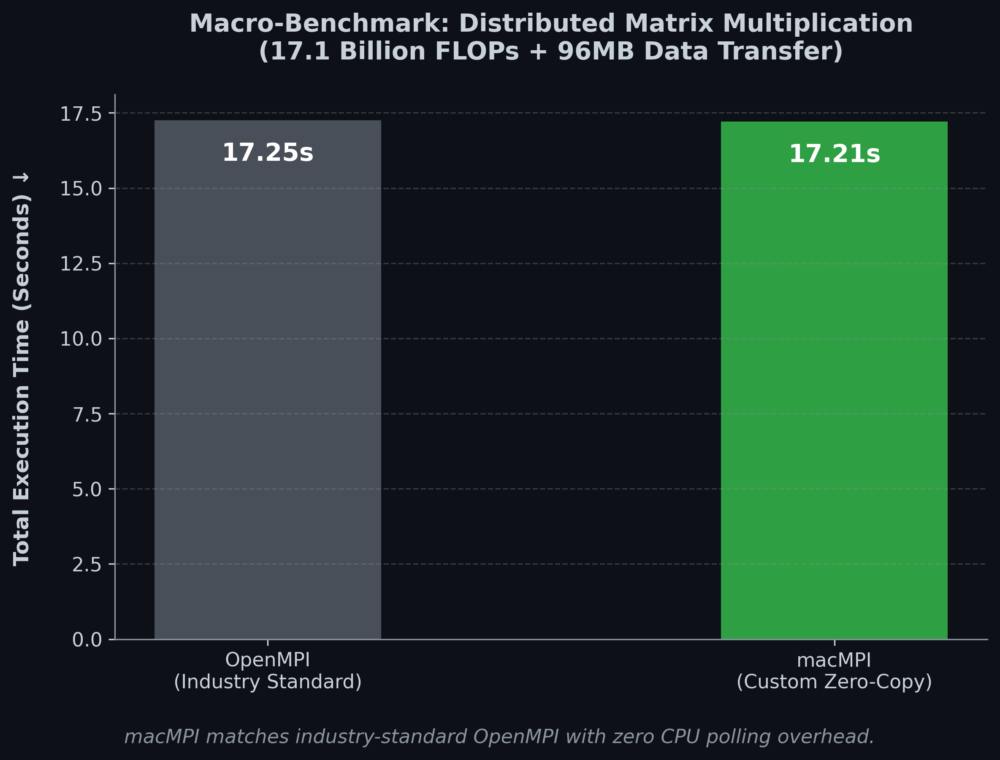

# macMPI

> **Move bytes. Not overhead.**

**macMPI** is an experimental, single-node MPI runtime built from scratch in C11 for macOS and Apple Silicon. It separates control traffic from payload movement: Unix-domain sockets carry compact message metadata, while POSIX shared memory carries the data between ranks.

[](https://en.wikipedia.org/wiki/C11_%28C_standard_revision%29)
[](https://developer.apple.com/macos/)
[](https://developer.apple.com/apple-silicon/)
[](https://cmake.org/)
[](#project-status)

[Documentation](https://hardikgupta1709.github.io/macMpi/) · [Build and run](#build-and-run) · [Architecture](#architecture) · [Benchmarks](#benchmarks) · [API coverage](#api-coverage)

## Why macMPI?

Most MPI implementations are designed for portability across operating systems and networks. macMPI deliberately narrows the problem: fast communication between processes on one Apple Silicon machine.

- **Darwin-native eventing** — a background progress thread uses `kqueue` to discover incoming control messages.
- **Shared-memory payloads** — every rank owns a 64 MiB slab in a POSIX shared-memory arena.
- **Small control messages** — a full mesh of Unix-domain sockets carries aligned 64-byte headers rather than application payloads.
- **Asynchronous point-to-point operations** — `MPI_Isend`, `MPI_Irecv`, `MPI_Test`, and `MPI_Wait` are backed by a request queue and progress engine.
- **Topology-aware collectives** — barriers, broadcasts, reductions, gathers, scatters, and all-to-all operations use decentralized communication patterns.
- **Inspectable implementation** — the runtime, launcher, progress engine, and collectives are implemented in a compact C11 codebase.

> [!IMPORTANT]
> macMPI is a focused MPI-1.1 subset for experimentation and single-machine workloads. It is not currently a complete, ABI-compatible replacement for OpenMPI or MPICH, and it does not provide multi-node network transport.

## Architecture



### Process runtime

`mpirun` creates a full mesh of Unix socket pairs, launches ranks with `fork()` and `exec()`, and injects the rank, world size, and inherited socket descriptors through environment variables. Rank output is collected through pipes and multiplexed by the launcher.

### Hybrid transport

Each process maps the same POSIX shared-memory object and receives a private 64 MiB slab. Sending a payload copies it into the sender's slab, then sends a compact header containing its location to the destination rank. The receiver copies the payload from shared memory into the posted receive buffer.

This design keeps large payloads out of the socket path while preserving MPI-style buffer semantics.

### Progress and matching

Non-blocking requests enter a thread-safe queue consumed by a dedicated progress thread. The engine uses `kqueue` for peer-socket events and supports:

- posted send and receive requests;
- source and tag matching, including `MPI_ANY_SOURCE` and `MPI_ANY_TAG`;
- an Unexpected Message Queue for messages that arrive before their matching receive;
- completion through `MPI_Test` and `MPI_Wait`.

### Collectives

macMPI builds collective operations on top of its point-to-point layer:

- dissemination and tree barriers;
- binomial-tree broadcast;
- tree-based reduction and all-reduction;
- scatter, gather, and all-gather;
- all-to-all exchange.

## API coverage

| Area                        | Implemented                                                                                                             |
| --------------------------- | ----------------------------------------------------------------------------------------------------------------------- |
| Runtime                     | `MPI_Init`, `MPI_Finalize`, `MPI_Comm_rank`, `MPI_Comm_size`, `MPI_Wtime`                                               |
| Blocking point-to-point     | `MPI_Send`, `MPI_Recv`                                                                                                  |
| Non-blocking point-to-point | `MPI_Isend`, `MPI_Irecv`, `MPI_Test`, `MPI_Wait`                                                                        |
| Collectives                 | `MPI_Barrier`, `MPI_Bcast`, `MPI_Reduce`, `MPI_Allreduce`, `MPI_Scatter`, `MPI_Gather`, `MPI_Allgather`, `MPI_Alltoall` |
| Datatypes                   | `MPI_INT`, `MPI_FLOAT`, `MPI_DOUBLE`, `MPI_CHAR`, `MPI_BYTE`                                                            |
| Reduction operations        | `MPI_SUM`, `MPI_MAX`, `MPI_MIN`, `MPI_PROD`                                                                             |
| Matching                    | Exact source/tag matching, `MPI_ANY_SOURCE`, `MPI_ANY_TAG`                                                              |

## Build and run

### Requirements

- Apple Silicon Mac
- macOS
- Apple Clang from the Xcode Command Line Tools
- CMake 3.20 or newer
- Ninja

Install the build tools with Homebrew if needed:

```bash
xcode-select --install
brew install cmake ninja
```

Clone and build a release configuration:

```bash
git clone https://github.com/Hardikgupta1709/macMpi.git
cd macMpi

cmake -S . -B build -G Ninja -DCMAKE_BUILD_TYPE=Release
cmake --build build --parallel
```

Launch four ranks:

```bash
./build/mpirun -n 4 "$PWD/build/hello_env"
```

Exercise the asynchronous progress engine:

```bash
./build/mpirun -n 2 "$PWD/build/test_engine"
```

Run the bundled shared-memory benchmark:

```bash
./build/mpirun -n 2 "$PWD/build/benchmark_shm"
```

## Benchmarks

Benchmarks are measurements of a particular workload and machine, not universal performance guarantees. Results will vary with the Apple SoC, macOS version, compiler, optimization flags, rank count, thermals, and background activity.

### Shared-memory point-to-point throughput

The bundled `benchmark_shm` test exchanges a 19.07 MiB payload between two ranks for 1,000 round trips. The recorded run below reported **102.99 GB/s** of aggregate point-to-point bandwidth.



### Distributed matrix multiplication

This macro-benchmark combines approximately **17.1 billion floating-point operations** with **96 MB of inter-rank data transfer**.



| Runtime | Total execution time |
| ------- | -------------------: |
| OpenMPI |              17.25 s |
| macMPI  |              17.21 s |

The two runtimes finish within approximately **0.3%** of one another in this run. The result demonstrates performance parity for this measured workload; it should not be interpreted as a general claim that either runtime is faster across all MPI programs.

For a reproducible comparison, record the Mac model and SoC, macOS version, compiler version and flags, matrix dimensions, rank count, warm-up policy, number of repetitions, and the OpenMPI version alongside future results.

## Repository layout

```text
.
├── include/
│   └── mpi.h              Public MPI interface
├── src/
│   ├── mpi.c              Runtime and point-to-point API
│   ├── engine.c           Progress thread and message matching
│   ├── collectives.c      Collective algorithms
│   ├── mpi_internal.h     Internal state and transport structures
│   └── mpirun.c           Local process launcher
├── tests/                 Functional tests and benchmarks
├── assets/                README benchmark images
└── CMakeLists.txt
```

## Project status

macMPI is under active development and is best suited to systems experimentation, MPI education, and local Apple Silicon workloads.

### Implemented

- [x] Local rank creation and lifecycle management
- [x] Unix-domain socket control mesh
- [x] POSIX shared-memory payload transport
- [x] Background progress engine
- [x] Blocking and non-blocking point-to-point operations
- [x] Core collective operations
- [x] Shared-memory throughput benchmark

### Planned

- [ ] Derived datatypes such as `MPI_Type_vector`
- [ ] Dynamic communicators such as `MPI_Comm_split`
- [ ] Broader MPI error handling and validation
- [ ] Stress, sanitiser, and concurrency test coverage
- [ ] Reproducible benchmark automation and metadata
- [ ] Continuous integration on Apple Silicon runners

## Contributing

Issues and pull requests are welcome. For bug reports, include:

- Mac model and Apple SoC;
- macOS version;
- Apple Clang and CMake versions;
- the number of ranks;
- the smallest program that reproduces the problem;
- the complete launcher output.

Please keep performance claims reproducible and include both the raw measurements and the commands used to generate them.

## License

This repository does not currently declare an open-source license. Until a license is added, the source is available for inspection but no permission to copy, modify, or redistribute it is granted.
