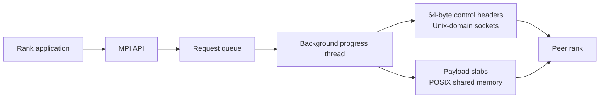

# macMPI

> **Move bytes. Not overhead.**

**macMPI** is an experimental, single-node MPI runtime built from scratch in C11 for macOS and Apple Silicon. It separates control traffic from payload movement: Unix-domain sockets carry compact message metadata, while POSIX shared memory carries the data between ranks.

[](https://en.wikipedia.org/wiki/C11_%28C_standard_revision%29)
[](https://developer.apple.com/macos/)
[](https://developer.apple.com/apple-silicon/)
[](https://cmake.org/)
[](#project-status)

[Documentation](https://hardikgupta1709.github.io/macMpi/) · [Build and run](#build-and-run) · [Architecture](#architecture) · [Benchmarks](#benchmarks) · [API coverage](#api-coverage)

## Why macMPI?

Most MPI implementations are designed for portability across operating systems and networks. macMPI deliberately narrows the problem: fast communication between processes on one Apple Silicon machine.

- **Darwin-native eventing** — a background progress thread uses `kqueue` to discover incoming control messages.
- **Shared-memory payloads** — every rank owns a 64 MiB slab in a POSIX shared-memory arena.
- **Small control messages** — a full mesh of Unix-domain sockets carries aligned 64-byte headers rather than application payloads.
- **Asynchronous point-to-point operations** — `MPI_Isend`, `MPI_Irecv`, `MPI_Test`, and `MPI_Wait` are backed by a request queue and progress engine.
- **Topology-aware collectives** — barriers, broadcasts, reductions, gathers, scatters, and all-to-all operations use decentralized communication patterns.
- **Inspectable implementation** — the runtime, launcher, progress engine, and collectives are implemented in a compact C11 codebase.

> [!IMPORTANT]
> macMPI is a focused MPI-1.1 subset for experimentation and single-machine workloads. It is not currently a complete, ABI-compatible replacement for OpenMPI or MPICH, and it does not provide multi-node network transport.

## Architecture



### Process runtime

`mpirun` creates a full mesh of Unix socket pairs, launches ranks with `fork()` and `exec()`, and injects the rank, world size, and inherited socket descriptors through environment variables. Rank output is collected through pipes and multiplexed by the launcher.

### Hybrid transport

Each process maps the same POSIX shared-memory object and receives a private 64 MiB slab. Sending a payload copies it into the sender's slab, then sends a compact header containing its location to the destination rank. The receiver copies the payload from shared memory into the posted receive buffer.

This design keeps large payloads out of the socket path while preserving MPI-style buffer semantics.

### Progress and matching

Non-blocking requests enter a thread-safe queue consumed by a dedicated progress thread. The engine uses `kqueue` for peer-socket events and supports:

- posted send and receive requests;
- source and tag matching, including `MPI_ANY_SOURCE` and `MPI_ANY_TAG`;
- an Unexpected Message Queue for messages that arrive before their matching receive;
- completion through `MPI_Test` and `MPI_Wait`.

### Collectives

macMPI builds collective operations on top of its point-to-point layer:

- dissemination and tree barriers;
- binomial-tree broadcast;
- tree-based reduction and all-reduction;
- scatter, gather, and all-gather;
- all-to-all exchange.

## API coverage

| Area                        | Implemented                                                                                                             |
| --------------------------- | ----------------------------------------------------------------------------------------------------------------------- |
| Runtime                     | `MPI_Init`, `MPI_Finalize`, `MPI_Comm_rank`, `MPI_Comm_size`, `MPI_Wtime`                                               |
| Blocking point-to-point     | `MPI_Send`, `MPI_Recv`                                                                                                  |
| Non-blocking point-to-point | `MPI_Isend`, `MPI_Irecv`, `MPI_Test`, `MPI_Wait`                                                                        |
| Collectives                 | `MPI_Barrier`, `MPI_Bcast`, `MPI_Reduce`, `MPI_Allreduce`, `MPI_Scatter`, `MPI_Gather`, `MPI_Allgather`, `MPI_Alltoall` |
| Datatypes                   | `MPI_INT`, `MPI_FLOAT`, `MPI_DOUBLE`, `MPI_CHAR`, `MPI_BYTE`                                                            |
| Reduction operations        | `MPI_SUM`, `MPI_MAX`, `MPI_MIN`, `MPI_PROD`                                                                             |
| Matching                    | Exact source/tag matching, `MPI_ANY_SOURCE`, `MPI_ANY_TAG`                                                              |

## Build and run

### Requirements

- Apple Silicon Mac
- macOS
- Apple Clang from the Xcode Command Line Tools
- CMake 3.20 or newer
- Ninja

### Build Instructions

```bash
# Clone the repository
git clone https://github.com/hardikgupta1709/macMPI.git
cd macMPI

# Configure and build
cmake -S . -B build -G Ninja
cmake --build build
```
